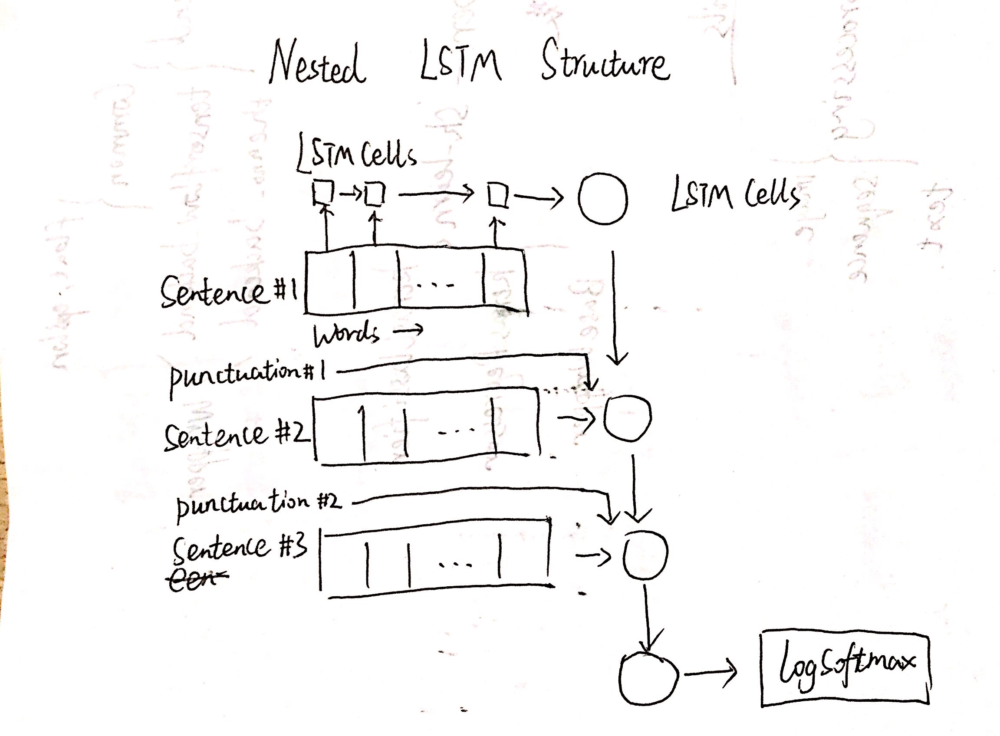

# Nested LSTM for Classifying Yelp Reviews

This repo contains the toy notebook for my project Nested LSTM for Classifying Yelp Reviews.

## The Task
Inspired by the scalable of RNN networks like LSTM, I'm trying to apply this recurrent structure both on word level and sentence level. That is the inner LSTM Series output the feature of sentence, then the outer LSTM accumulate these states to the review paragraph and output the final classification probabilities.

## Preprocessing
In NLP tasks, text preprocessing is essential. We perform ordinary preprocessing like lowercasing, spell checks and stemming. Additionally, as punctuation may play a crucial role in sentiment analysis, we also encode the punctuation separately in preprocessing.

## Emebedding
We use the [GloVe](https://github.com/stanfordnlp/GloVe) pre-trained model to embed words into its distributed representation. We got a lot of help from Python package [torchwordemb](https://github.com/iamalbert/torch-word-emb) in this step.

## Network structure
The base structure is LSTM. We apply this structure both on sentence leve and word level.

## Next step
The training process is rather slow. We are considering padding words or sentences to take advantage of mini-batches.
